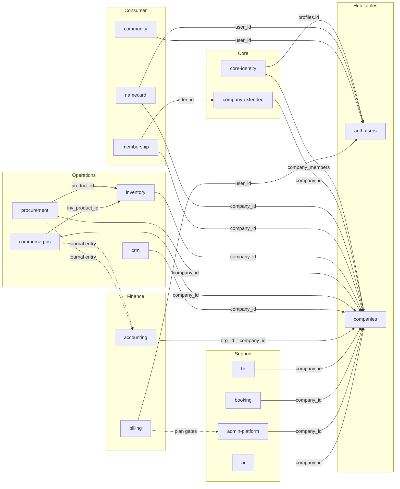

# Cross-Module Linkage

> Auto-generated from Supabase database on 2025-07-21
> Documents all foreign key relationships across modules, integration patterns, and shared functions

---

## Module Relationship Diagram



---

## All Cross-Module Foreign Keys

### From core-identity

| From Table.Column | → To Module | To Table.Column |
|-------------------|-------------|-----------------|
| profiles.id | auth | auth.users.id |
| profiles.business_active_company_id | core-identity | companies.id |
| companies.created_by | auth | auth.users.id |
| company_members.company_id | core-identity | companies.id |
| company_members.user_id | auth | auth.users.id |

### From company-extended

| From Table.Column | → To Module | To Table.Column |
|-------------------|-------------|-----------------|
| company_addresses.company_id | core-identity | companies.id |
| company_key_contacts.company_id | core-identity | companies.id |
| company_documents.company_id | core-identity | companies.id |
| company_documents.uploaded_by | auth | auth.users.id |
| company_bank_accounts.company_id | core-identity | companies.id |
| company_social_profiles.company_id | core-identity | companies.id |
| company_operating_hours.company_id | core-identity | companies.id |
| company_offers.company_id | core-identity | companies.id |

### From namecard

| From Table.Column | → To Module | To Table.Column |
|-------------------|-------------|-----------------|
| business_cards.user_id | auth | auth.users.id |
| business_cards.company_id | core-identity | companies.id |
| nfc_cards.owner_id | auth | auth.users.id |
| nfc_cards.linked_card_id | namecard | business_cards.id |
| nfc_cards.company_id | core-identity | companies.id |
| nfc_card_intake_batches.company_id | core-identity | companies.id |

### From community

| From Table.Column | → To Module | To Table.Column |
|-------------------|-------------|-----------------|
| forum_posts.author_id | auth | auth.users.id |
| forum_replies.author_id | auth | auth.users.id |
| posts.user_id | auth | auth.users.id |
| connections.requester_id | auth | auth.users.id |
| connections.receiver_id | auth | auth.users.id |

### From membership

| From Table.Column | → To Module | To Table.Column |
|-------------------|-------------|-----------------|
| membership_programs.company_id | core-identity | companies.id |
| membership_accounts.company_id | core-identity | companies.id |
| membership_accounts.user_id | auth | auth.users.id |
| membership_transactions.company_id | core-identity | companies.id |
| membership_points_ledger.company_id | core-identity | companies.id |
| membership_spend_transactions.company_id | core-identity | companies.id |
| membership_spend_transactions.user_id | auth | auth.users.id |
| offer_redemptions.offer_id | **company-extended** | company_offers.id |
| offer_redemptions.user_id | auth | auth.users.id |

### From inventory

| From Table.Column | → To Module | To Table.Column |
|-------------------|-------------|-----------------|
| inv_products.company_id | core-identity | companies.id |
| inv_stock_balances.company_id | core-identity | companies.id |
| inv_stock_movements.company_id | core-identity | companies.id |

### From procurement

| From Table.Column | → To Module | To Table.Column |
|-------------------|-------------|-----------------|
| proc_suppliers.company_id | core-identity | companies.id |
| proc_purchase_orders.company_id | core-identity | companies.id |
| proc_purchase_order_items.company_id | core-identity | companies.id |
| proc_purchase_order_items.product_id | **inventory** | inv_products.id |
| proc_purchase_requests.company_id | core-identity | companies.id |
| proc_receipts.company_id | core-identity | companies.id |
| proc_receipt_items.product_id | **inventory** | inv_products.id |
| proc_contracts.company_id | core-identity | companies.id |

### From commerce-pos

| From Table.Column | → To Module | To Table.Column |
|-------------------|-------------|-----------------|
| pos_registers.company_id | core-identity | companies.id |
| pos_products.company_id | core-identity | companies.id |
| pos_products.inv_product_id | **inventory** | inv_products.id |
| pos_shifts.company_id | core-identity | companies.id |
| pos_shifts.user_id | auth | auth.users.id |
| pos_orders.company_id | core-identity | companies.id |
| pos_payment_operations.company_id | core-identity | companies.id |

### From crm

| From Table.Column | → To Module | To Table.Column |
|-------------------|-------------|-----------------|
| crm_leads.company_id | core-identity | companies.id |
| crm_deals.company_id | core-identity | companies.id |
| crm_contacts.company_id | core-identity | companies.id |
| crm_activities.company_id | core-identity | companies.id |
| crm_campaigns.company_id | core-identity | companies.id |
| crm_notes.owner_id | auth | auth.users.id |

### From accounting

| From Table.Column | → To Module | To Table.Column |
|-------------------|-------------|-----------------|
| organizations.id | **core-identity** | companies.id (1:1) |

### From hr

| From Table.Column | → To Module | To Table.Column |
|-------------------|-------------|-----------------|
| hr_employees.company_id | core-identity | companies.id |

### From booking

| From Table.Column | → To Module | To Table.Column |
|-------------------|-------------|-----------------|
| booking_services.company_id | core-identity | companies.id |

### From admin-platform

| From Table.Column | → To Module | To Table.Column |
|-------------------|-------------|-----------------|
| company_modules.company_id | core-identity | companies.id |
| company_security_settings.company_id | core-identity | companies.id |
| company_api_keys.company_id | core-identity | companies.id |
| company_audit_logs.company_id | core-identity | companies.id |
| admin_users.user_id | auth | auth.users.id |
| notifications.user_id | auth | auth.users.id |

### From billing

| From Table.Column | → To Module | To Table.Column |
|-------------------|-------------|-----------------|
| billing_payment_events.user_id | auth | auth.users.id |

---

## Integration Patterns

### 1. Company Hub Pattern (★ most important)

Almost every B2B module connects to `companies` via `company_id` FK. This makes `companies` the central hub:

**Modules directly referencing companies.id:**
- company-extended, namecard, membership, inventory, procurement, commerce-pos, crm, accounting (via organizations), hr, booking, admin-platform, ai, billing (via company_subscriptions)

**Total FKs to companies: ~40+**

### 2. Auth Hub Pattern

Many tables reference `auth.users` for user ownership:

**Modules referencing auth.users:**
- core-identity (profiles, company_members), namecard (business_cards, nfc_cards), community (posts, forum_posts, connections), membership (accounts, spend_transactions), commerce-pos (pos_shifts), admin-platform (admin_users, notifications), billing (payment_events)

### 3. Accounting ↔ Company (1:1 Overlay)

```
companies.id ←→ organizations.id (same UUID)
```

All accounting tables chain through `organizations`:
```
companies.id = organizations.id
  → accounts.org_id
  → transactions.org_id
  → invoices.org_id
  → contacts.org_id
  → tax_rates.org_id
  → currencies.org_id
  → documents.org_id
  → payroll_records.org_id
  → inventory_items.org_id
  → audit_log.org_id
```

### 4. Procurement → Inventory (direct FK)

```
proc_purchase_order_items.product_id → inv_products.id
proc_receipt_items.product_id → inv_products.id
```

**DB function:** `process_procurement_receipt()` automatically:
1. Creates receipt records
2. Triggers `inv_stock_movements` (movement_type='in')
3. Updates `inv_stock_balances.on_hand`

### 5. POS → Inventory (direct FK)

```
pos_products.inv_product_id → inv_products.id (optional)
```

**API integration:** When POS order completes:
1. Calls `record_inventory_movement(movement_type='out')` for each item with `inv_product_id`
2. `inv_stock_balances.on_hand` is atomically decremented

### 6. Invoice Paid → Accounting Journal (API-level)

When invoice status changes to `paid`:
```
createInvoicePaidJournalEntry() creates:
  → transactions (journal entry header)
  → transaction_lines: Debit Cash/Bank (1100) = invoice.total
  → transaction_lines: Credit Revenue (4100) = invoice.total
```

Uses idempotency key: `invoice-paid-{invoiceId}`

### 7. Procurement Receipt → Accounting Journal (API-level)

When goods receipt is processed:
```
createReceiptJournalEntry() creates:
  → transactions (journal entry header)
  → transaction_lines: Debit Inventory (1400) = total cost
  → transaction_lines: Credit Accounts Payable (2100) = total cost
```

Uses idempotency key: `receipt-{receiptId}`

### 8. POS Order → Accounting Journal (API-level)

When POS order completes:
```
createPosOrderJournalEntry() creates:
  → transactions (journal entry header)
  → transaction_lines: Debit Cash/Bank (1100) = order.total
  → transaction_lines: Credit Revenue (4100) = order.total
```

Uses idempotency key: `pos-order-{orderId}`

### 9. Membership → Company Offers (cross-module FK)

```
offer_redemptions.offer_id → company_offers.id (company-extended module)
offer_redemptions.account_id → membership_accounts.id
```

Members redeem company offers using loyalty points.

### 10. HR ↔ Accounting Payroll

```
hr_employees →(company_id)→ companies ←(organizations.id)← payroll_records
```

HR payroll can feed into accounting `payroll_records` for salary journal entries.

---

## Database Functions (Cross-Module)

### `process_procurement_receipt`
- **Module:** procurement → inventory
- **Params:** `p_company_id, p_po_id, p_received_by, p_note, p_idempotency_key, p_operation_id, p_correlation_id, p_occurred_at, p_items`
- **Returns:** `jsonb { receipt_id, status, movement_count }`
- **Description:** Validates PO, creates receipt + receipt_items, triggers inventory stock movements, updates PO status

### `record_inventory_movement`
- **Module:** inventory (called by procurement, POS)
- **Params:** `p_company_id, p_product_id, p_movement_type, p_qty, p_reason, p_reference_type, p_reference_id, p_created_by, p_idempotency_key, p_operation_id, p_correlation_id, p_occurred_at`
- **Returns:** `jsonb { movement_id, status, balance_on_hand }`
- **Description:** Records inventory stock movement, atomically updates balances, supports idempotency

### `can_manage_company`
- **Module:** auth/RLS
- **Params:** `company_id uuid`
- **Returns:** `boolean`
- **Description:** Checks if `auth.uid()` is an active member of the company — used by all company_* tables, CRM, POS, inventory, procurement RLS policies

### `can_read_accounting_org`
- **Module:** accounting/RLS
- **Params:** `org_id uuid`
- **Returns:** `boolean`
- **Description:** Checks if current user can read accounting data for the org

### `can_write_accounting_org`
- **Module:** accounting/RLS
- **Params:** `org_id uuid`
- **Returns:** `boolean`
- **Description:** Checks if current user can modify accounting data

---

## RLS Security Summary

| RLS Function | Used By Tables |
|-------------|----------------|
| `can_manage_company(company_id)` | company_addresses, company_key_contacts, company_documents, company_bank_accounts, company_social_profiles, company_operating_hours, company_offers, company_modules, company_security_settings, company_api_keys, company_audit_logs, inv_products, inv_stock_balances, inv_stock_movements, proc_suppliers, proc_purchase_orders, proc_purchase_order_items, proc_purchase_requests, proc_receipts, proc_receipt_items, proc_contracts, pos_registers, pos_products, pos_shifts, pos_orders, pos_order_items, crm_leads, crm_deals, crm_contacts, crm_activities, crm_campaigns, hr_employees, hr_leave_requests, hr_attendance, hr_payroll, booking_services |
| `can_read_accounting_org(org_id)` | organizations, accounts, transactions, transaction_lines, contacts, invoices, invoice_items, tax_rates, currencies, documents, payroll_records, inventory_items, audit_log |
| `can_write_accounting_org(org_id)` | organizations, accounts, transactions, transaction_lines, contacts, invoices, invoice_items, tax_rates, currencies, documents, payroll_records, inventory_items, audit_log |
| `auth.uid() = user_id` | profiles, business_cards, card_fields, card_links, card_experiences, posts |
| Public SELECT | boards, sub_boards, business_cards (by slug), booking_services (active) |

---

## Data Flow Summary

```
User Action          → Module Chain                        → Final State
─────────────────────────────────────────────────────────────────────────
Create PO            → procurement                         → proc_purchase_orders created
Receive Goods        → procurement → inventory → accounting → receipt + stock_movement + journal_entry
POS Sale             → commerce-pos → inventory → accounting → order + stock_deduction + journal_entry
Invoice Paid         → accounting                          → invoice status=paid + journal_entry
Member Redeems Offer → membership → company-extended       → offer_redemption + points_deducted
NFC Tap              → namecard                            → nfc_tap_log + card_share
User Connects        → community → admin                   → connection + notification
```
