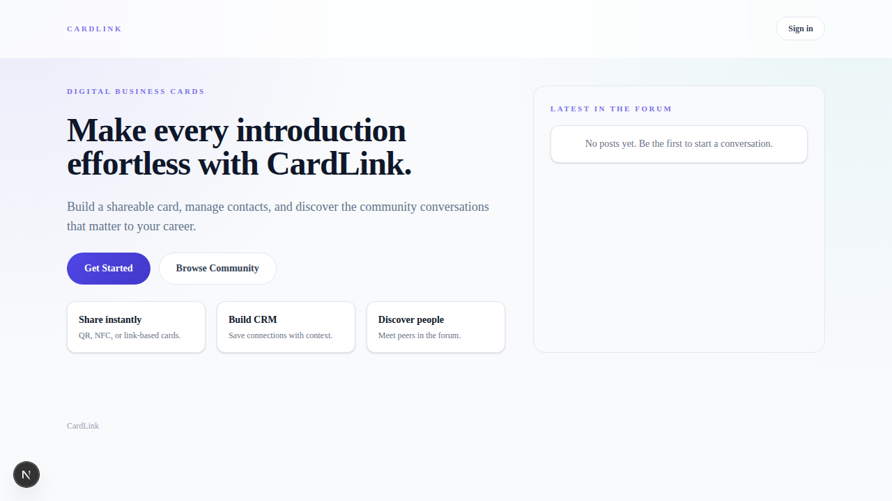
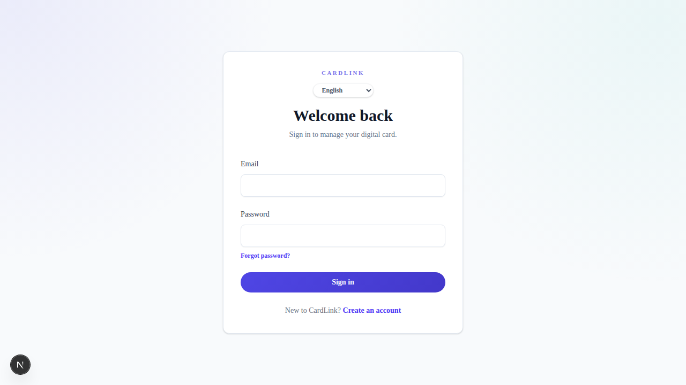
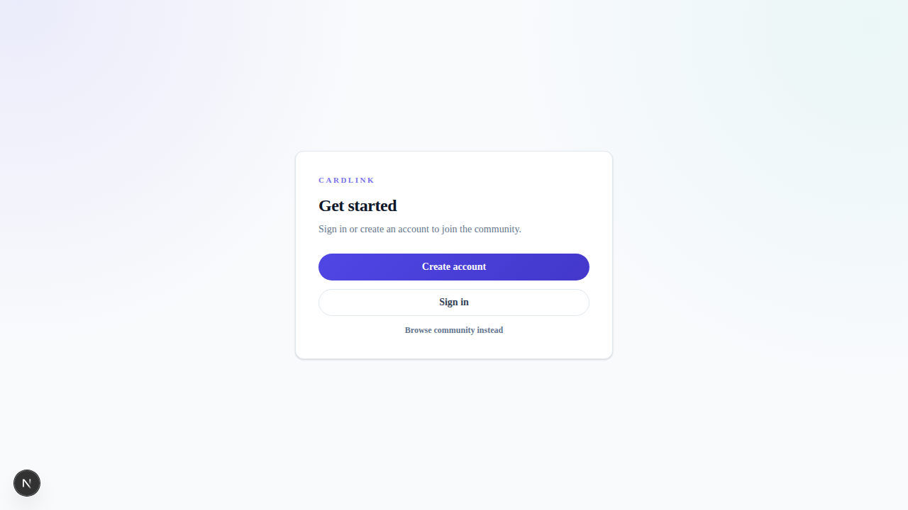
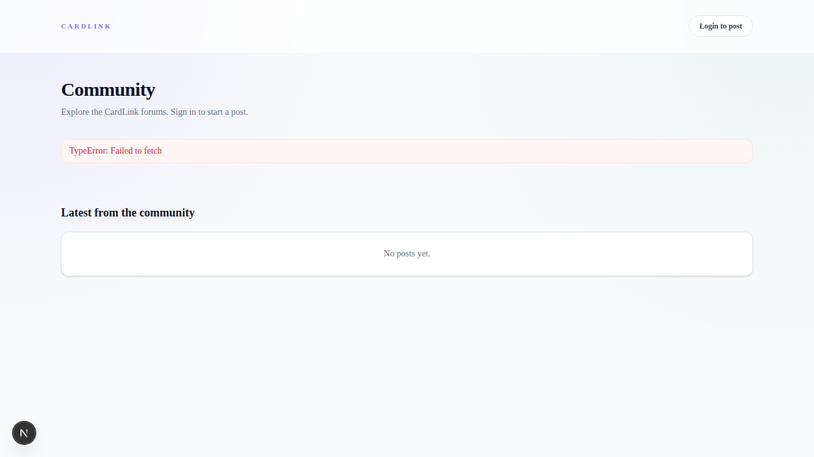

# CardLink

> **All-in-one business management platform** — digital business cards, CRM, accounting, HR, inventory, POS, online store, booking, procurement, and AI-powered insights — built with Next.js, Supabase, and Stripe.

---

## What Is CardLink?

CardLink is a comprehensive, multi-module SaaS platform designed for small-to-medium businesses that need a single hub for their operations. It started as a **digital business card** tool — share your card via QR code, NFC tap, or link — and grew into a **full ERP suite** covering everything from accounting and HR to point-of-sale and e-commerce. A built-in community forum lets users network and share knowledge.

### Key Highlights

- 🪪 **Digital Business Cards** — Create shareable cards with QR codes, NFC support, and public profile links.
- 📊 **14 Business Modules** — Dashboard, Accounting, HR, Inventory, POS, CRM, Booking, Procurement, Online Store, AI, Company Cards, Owner Admin, Settings, and Community.
- 🤖 **AI-Powered Assistant** — Conversational AI for business insights, audit reviews, and action recommendations (supports Poe and OpenAI-compatible providers).
- 🌐 **Multi-Language** — English, Simplified Chinese, Traditional Chinese (Taiwan), and Traditional Chinese (Hong Kong).
- 💳 **Stripe Billing** — Three-tier subscription model (Free / Professional / Business) with checkout, portal, and webhook integration.
- 🔐 **Row-Level Security** — Supabase RLS policies ensure data isolation between companies and users.

---

## Screenshots

| Landing Page | Login |
|:---:|:---:|
|  |  |

| Auth Gateway | Community Forum |
|:---:|:---:|
|  |  |

---

## Tech Stack

| Layer | Technology |
|-------|-----------|
| **Framework** | [Next.js 16](https://nextjs.org) (App Router, SSR) |
| **UI** | [React 19](https://react.dev) + [Tailwind CSS 4](https://tailwindcss.com) |
| **Database** | [Supabase](https://supabase.com) (PostgreSQL, 80+ tables) |
| **Auth** | Supabase Auth |
| **Payments** | [Stripe](https://stripe.com) (Checkout, Portal, Webhooks) |
| **State** | [Zustand](https://zustand.docs.pmnd.rs) |
| **i18n** | [next-intl](https://next-intl.dev) (EN, zh-CN, zh-TW, zh-HK) |
| **Charts** | [Recharts](https://recharts.org) |
| **Icons** | [Lucide React](https://lucide.dev) |
| **QR / Barcode** | qrcode.react + @zxing/browser |

---

## Modules

| # | Module | Path | Description |
|---|--------|------|-------------|
| 1 | **Dashboard** | `/business` | Central hub with stats, alerts, and AI action queue |
| 2 | **Accounting** | `/business/accounting` | Chart of accounts, invoices, bills, payments, P&L, balance sheet |
| 3 | **HR** | `/business/hr` | Employees, leave, attendance, payroll, departments, tax config |
| 4 | **Inventory** | `/business/inventory` | Products, categories, multi-warehouse, stock movements, counts |
| 5 | **POS** | `/business/pos` | Checkout terminal, orders, shifts, sales reports |
| 6 | **CRM** | `/business/crm` | Leads, contacts, deal pipeline, activities, campaigns |
| 7 | **Booking** | `/business/booking` | Services, appointments, availability, calendar, analytics |
| 8 | **Procurement** | `/business/procurement` | Vendors, purchase orders, contracts, goods receipt, bills |
| 9 | **Online Store** | `/business/store` | Product catalog, orders, customers, coupons, public checkout |
| 10 | **AI** | `/business/ai` | Chat assistant, action cards, setup, operations, business review |
| 11 | **Company Cards** | `/business/company-cards` | Digital card management with NFC & QR |
| 12 | **Owner / Admin** | `/business/owner` | Billing, team, API keys, audit logs, security, module toggles |
| 13 | **Settings** | `/business/settings` | Plan, company profile, language, notifications, integrations |
| 14 | **Community** | `/community` | Discussion boards with posts and replies |

---

## Getting Started

### Prerequisites

- **Node.js** ≥ 18
- A **Supabase** project ([supabase.com](https://supabase.com))
- (Optional) **Stripe** account for billing features
- (Optional) AI provider key (Poe or OpenAI-compatible) for AI features

### Installation

```bash
# 1. Clone the repository
git clone https://github.com/martinwong68/Cardlink.git
cd Cardlink/cardlink

# 2. Install dependencies
npm install

# 3. Configure environment
cp .env.example .env.local
#    Fill in your Supabase and (optionally) Stripe / AI keys

# 4. Apply database migrations
#    In Supabase Dashboard → SQL Editor, run each file in
#    supabase/migrations/ in filename order.
#    Or use Supabase CLI: supabase db push

# 5. Seed subscription plans (required)
#    Run supabase/migrations/20260318_005_seed_subscription_plans.sql

# 6. (Optional) Seed demo data
node scripts/seed-trial-data.mjs demo@cardlink.test

# 7. Start the dev server
npm run dev
#    Open http://localhost:3000
```

### Environment Variables

Copy `.env.example` → `.env.local` and configure:

| Variable | Required | Purpose |
|----------|----------|---------|
| `NEXT_PUBLIC_SUPABASE_URL` | ✅ | Supabase project URL |
| `NEXT_PUBLIC_SUPABASE_ANON_KEY` | ✅ | Supabase anonymous key |
| `SUPABASE_SERVICE_ROLE_KEY` | ✅ | Supabase service-role key (admin ops) |
| `STRIPE_SECRET_KEY` | Billing | Stripe secret key |
| `STRIPE_WEBHOOK_SECRET` | Billing | Stripe webhook signing secret |
| `NEXT_PUBLIC_STRIPE_PUBLISHABLE_KEY` | Billing | Stripe publishable key |
| `AI_PROVIDER` | AI | `poe` or `openai` |
| `AI_POE_API_KEY` | AI (Poe) | Poe API key |
| `AI_OPENAI_API_KEY` | AI (OpenAI) | OpenAI-compatible API key |

> **Tip:** The app starts without Stripe or AI keys — those features gracefully degrade with a 503 or helpful error message.

---

## Project Structure

```
Cardlink/
├── cardlink/                   # Next.js application root
│   ├── app/                    # Pages & API routes (App Router)
│   │   ├── api/                #   REST API endpoints
│   │   ├── business/           #   Business dashboard & modules
│   │   ├── dashboard/          #   User dashboard (cards, feed, NFC)
│   │   ├── community/          #   Forum / discussion boards
│   │   ├── auth/, login/,      #   Authentication flows
│   │   │   signup/, register/
│   │   ├── c/[slug]/           #   Public card pages
│   │   └── tap/[uid]/          #   NFC tap landing pages
│   ├── components/             # Shared React components
│   ├── src/lib/                # Utilities, Supabase clients, helpers
│   ├── messages/               # i18n translation files (4 locales)
│   ├── supabase/migrations/    # SQL migration files (80+ tables)
│   └── public/                 # Static assets
├── docs/                       # Documentation & guides
│   ├── APP_GUIDE.md            # Architecture & module reference
│   ├── DATABASE_SCHEMA.md      # Full database schema
│   ├── contracts/              # API contract specifications
│   └── screenshots/            # App screenshots
└── scripts/                    # Seed data & utility scripts
```

---

## Subscription Plans

| Feature | Free | Professional ($29/mo) | Business ($79/mo) |
|---------|------|----------------------|-------------------|
| Companies | 1 | 3 | Unlimited |
| Team members | 1 | 5 | 20 |
| Storage | 500 MB | 5 GB | 50 GB |
| AI actions / mo | — | 200 | 2,000 |

Billing is handled entirely through Stripe Checkout with inline `price_data` — no pre-created Stripe products required.

---

## Available Scripts

| Command | Description |
|---------|-------------|
| `npm run dev` | Start development server |
| `npm run build` | Production build |
| `npm run start` | Start production server |
| `npm run lint` | Run ESLint |
| `npm run db:seed-trial` | Seed demo data |
| `npm run db:check-context` | Validate business context |

---

## Documentation

Detailed guides are in the [`docs/`](docs/) directory:

- **[APP_GUIDE.md](docs/APP_GUIDE.md)** — Architecture overview, module reference, billing flow, and environment setup
- **[DATABASE_SCHEMA.md](docs/DATABASE_SCHEMA.md)** — Full schema reference for 80+ tables
- **Gap analysis docs** — Feature audits for each module (Accounting, AI, HR, CRM, POS, Booking, Store, Procurement, Inventory)
- **Contract specifications** — API contracts for NameCard, POS, Company Management, Procurement, and Inventory

---

## License

This project is private and not currently open-sourced.